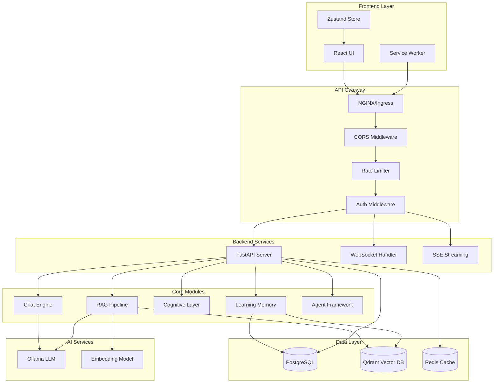
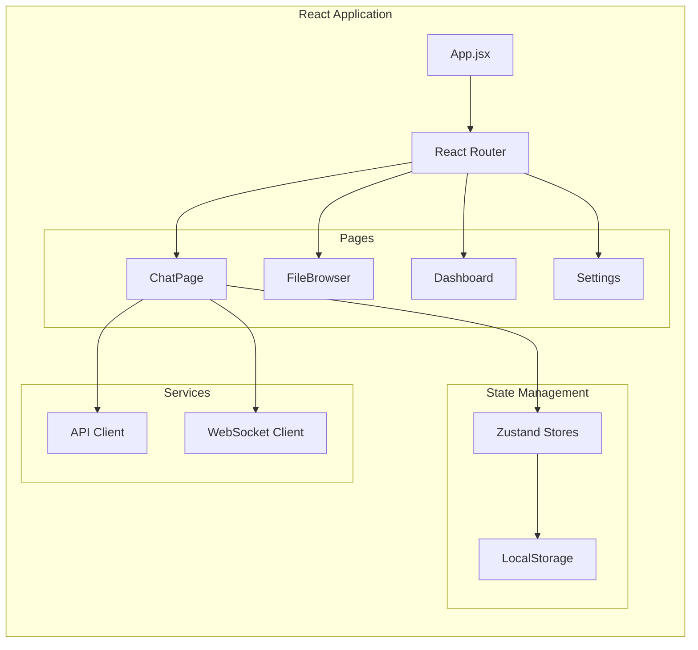
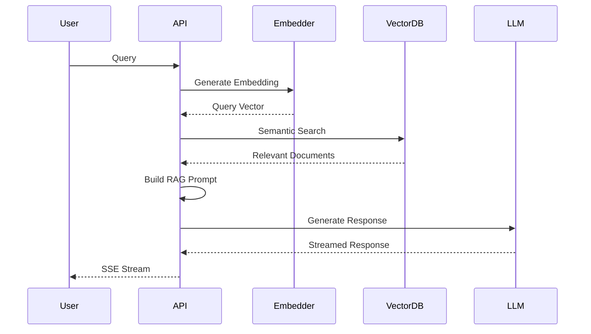
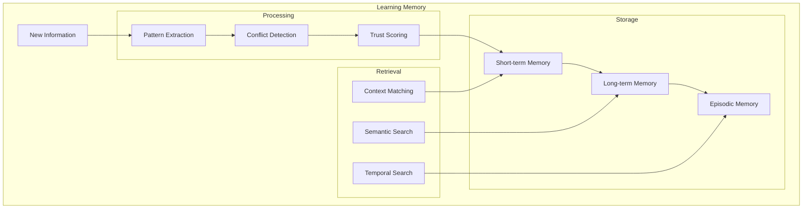
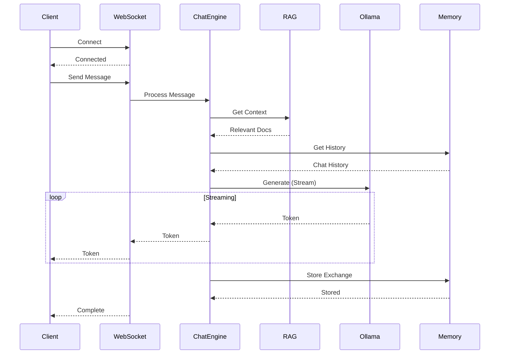
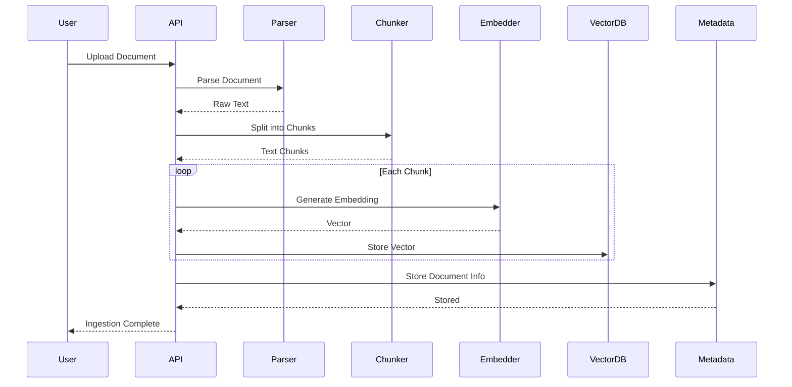
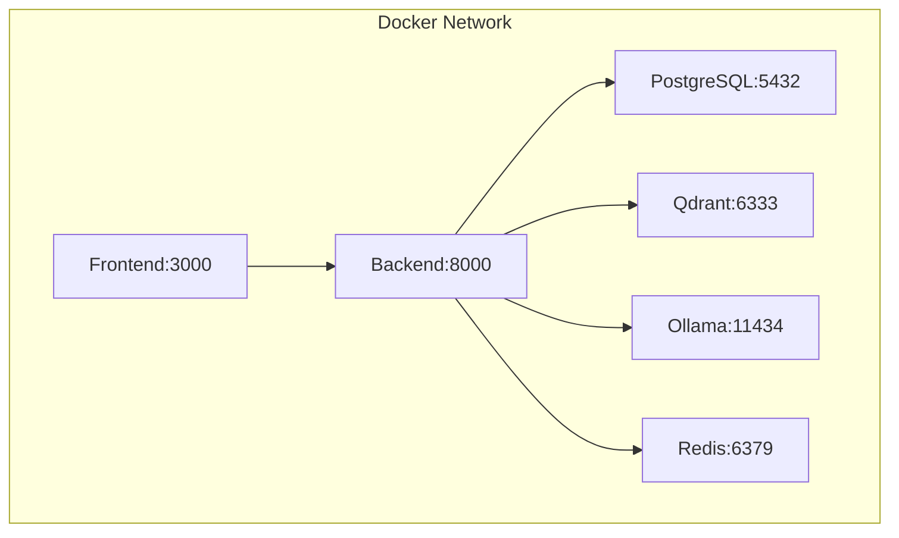
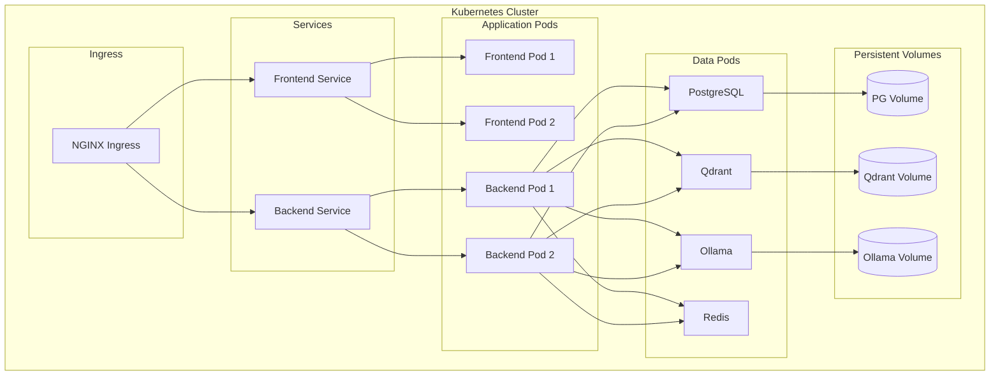
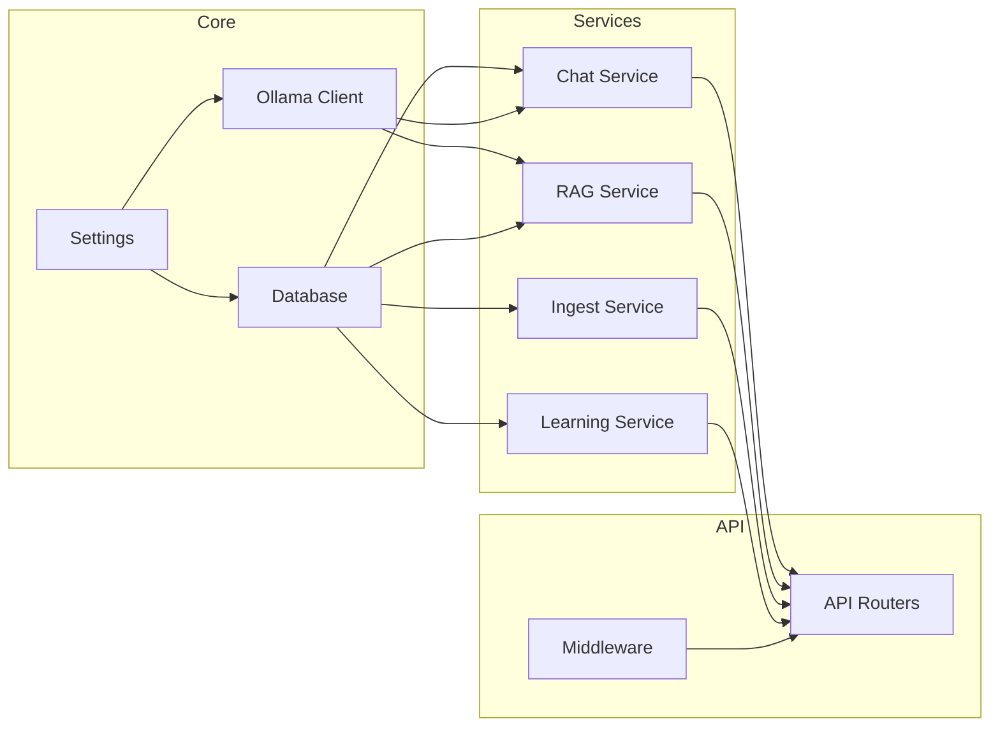

# GRACE Architecture

## System Overview

GRACE (Guided Reasoning and Autonomous Cognitive Engine) is an enterprise-grade AI system built on a modular, scalable architecture.



## Component Architecture

### Frontend Architecture



### Backend Architecture

```mermaid
graph TB
    subgraph "FastAPI Application"
        Main[app.py]

        subgraph "API Routers"
            ChatAPI[/api/chat]
            IngestAPI[/api/ingest]
            RetrieveAPI[/api/retrieve]
            HealthAPI[/api/health]
            MetricsAPI[/metrics]
        end

        subgraph "Middleware Stack"
            Security[Security Headers]
            RateLimit[Rate Limiting]
            Logging[Structured Logging]
            Genesis[Genesis Key Tracking]
        end

        subgraph "Core Services"
            OllamaClient[Ollama Client]
            Embedder[Async Embedder]
            VectorDB[Qdrant Client]
            DBSession[DB Session]
        end
    end

    Main --> Security
    Security --> RateLimit
    RateLimit --> Logging
    Logging --> Genesis

    Genesis --> ChatAPI
    Genesis --> IngestAPI
    Genesis --> RetrieveAPI
    Genesis --> HealthAPI
    Genesis --> MetricsAPI

    ChatAPI --> OllamaClient
    IngestAPI --> Embedder
    IngestAPI --> VectorDB
    RetrieveAPI --> VectorDB
    RetrieveAPI --> OllamaClient
```

### RAG Pipeline



### Learning Memory System



## Data Flow

### Chat Message Flow



### Document Ingestion Flow



## Deployment Architecture

### Docker Compose (Development)



### Kubernetes (Production)



## Security Architecture

```mermaid
graph TB
    subgraph "Security Layers"
        subgraph "Transport"
            TLS[TLS/SSL]
        end

        subgraph "Application"
            Auth[JWT Authentication]
            RBAC[Role-Based Access]
            API_Key[API Key Validation]
        end

        subgraph "Request Processing"
            RateLimit[Rate Limiting]
            Validation[Input Validation]
            Sanitization[Data Sanitization]
        end

        subgraph "Data"
            Encryption[At-Rest Encryption]
            Secrets[Secret Management]
        end
    end

    TLS --> Auth
    Auth --> RBAC
    RBAC --> API_Key
    API_Key --> RateLimit
    RateLimit --> Validation
    Validation --> Sanitization
    Sanitization --> Encryption
    Encryption --> Secrets
```



## Module Dependencies



## Technology Stack

| Layer | Technology |
|-------|------------|
| Frontend | React 19, Material-UI, Zustand |
| Backend | Python 3.11, FastAPI, Pydantic |
| Database | PostgreSQL 15, SQLAlchemy |
| Vector DB | Qdrant |
| LLM | Ollama (Mistral, Llama, etc.) |
| Cache | Redis |
| Container | Docker, Kubernetes |
| CI/CD | Genesis CI (native) |
| Monitoring | Prometheus, Grafana |
