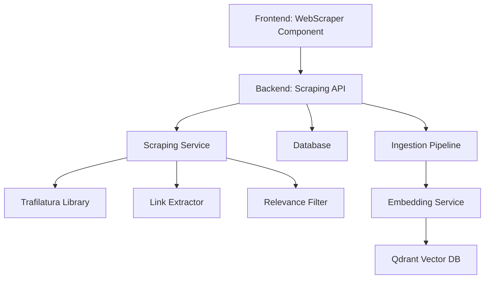

# Web Scraping Feature - Implementation Plan

## 📋 Overview

**Feature**: Web Content Scraping with Depth Control  
**Library**: [Trafilatura](https://trafilatura.readthedocs.io/en/latest/)  
**User Story**: Users can submit website URLs and specify a crawl depth to automatically extract and store content from the website and related pages.

---

## 🎯 Requirements

### Functional Requirements

1. **URL Submission**: Users can input one or more URLs
2. **Depth Control**: Users specify how deep to crawl (0-5 levels)
   - Depth 0: Only the submitted URL
   - Depth 1: Submitted URL + direct links
   - Depth 2+: Recursive crawling based on relevance
3. **Content Extraction**: Extract main text content using trafilatura
4. **Link Discovery**: Find and follow relevant links on each page
5. **Relevance Filtering**: Only follow links related to the original topic
6. **Progress Tracking**: Show real-time scraping progress
7. **Error Handling**: Handle invalid URLs, timeouts, and edge cases

### Non-Functional Requirements

1. **Performance**: Async scraping to avoid blocking
2. **Reliability**: Robust error handling and retry logic
3. **Scalability**: Queue-based processing for multiple URLs
4. **User Experience**: Clear feedback and progress indicators

---

## 🏗️ Architecture Design

### Component Overview



### Data Flow

```
1. User submits URL + depth
2. Backend validates URL
3. Create scraping job in database
4. Start async scraping task
5. For each page:
   a. Fetch content
   b. Extract text with trafilatura
   c. Extract links
   d. Filter relevant links
   e. Store content
   f. Queue child URLs (if depth remaining)
6. Update job status
7. Frontend polls for progress
8. Display results when complete
```

---

## 🗄️ Database Schema

### New Tables

#### `scraping_jobs`
```sql
CREATE TABLE scraping_jobs (
    id INTEGER PRIMARY KEY AUTOINCREMENT,
    url TEXT NOT NULL,
    depth INTEGER NOT NULL DEFAULT 0,
    status TEXT NOT NULL DEFAULT 'pending',  -- pending, running, completed, failed
    total_pages INTEGER DEFAULT 0,
    pages_scraped INTEGER DEFAULT 0,
    pages_failed INTEGER DEFAULT 0,
    created_at TIMESTAMP DEFAULT CURRENT_TIMESTAMP,
    started_at TIMESTAMP,
    completed_at TIMESTAMP,
    error_message TEXT,
    folder_path TEXT  -- where to store scraped content
);
```

#### `scraped_pages`
```sql
CREATE TABLE scraped_pages (
    id INTEGER PRIMARY KEY AUTOINCREMENT,
    job_id INTEGER NOT NULL,
    url TEXT NOT NULL,
    depth_level INTEGER NOT NULL,
    parent_url TEXT,
    title TEXT,
    content TEXT,
    content_length INTEGER,
    status TEXT NOT NULL DEFAULT 'pending',  -- pending, success, failed
    error_message TEXT,
    scraped_at TIMESTAMP,
    document_id INTEGER,  -- FK to documents table after ingestion
    FOREIGN KEY (job_id) REFERENCES scraping_jobs(id) ON DELETE CASCADE
);
```

---

## 🔌 API Endpoints

### 1. Submit Scraping Job

**Endpoint**: `POST /scrape/submit`

**Request Body**:
```json
{
  "url": "https://example.com",
  "depth": 2,
  "folder_path": "scraped/example",
  "max_pages": 100,  // optional limit
  "same_domain_only": true  // optional: stay on same domain
}
```

**Response**:
```json
{
  "job_id": 123,
  "status": "pending",
  "message": "Scraping job created successfully"
}
```

### 2. Get Job Status

**Endpoint**: `GET /scrape/status/{job_id}`

**Response**:
```json
{
  "job_id": 123,
  "url": "https://example.com",
  "depth": 2,
  "status": "running",
  "total_pages": 45,
  "pages_scraped": 23,
  "pages_failed": 2,
  "progress_percentage": 51,
  "started_at": "2026-01-13T10:00:00Z",
  "estimated_completion": "2026-01-13T10:05:00Z"
}
```

### 3. Get Job Results

**Endpoint**: `GET /scrape/results/{job_id}`

**Response**:
```json
{
  "job_id": 123,
  "status": "completed",
  "pages": [
    {
      "url": "https://example.com",
      "title": "Example Page",
      "depth_level": 0,
      "content_length": 5432,
      "document_id": 456
    },
    ...
  ],
  "summary": {
    "total_pages": 45,
    "successful": 43,
    "failed": 2,
    "total_content_size": 234567
  }
}
```

### 4. Cancel Job

**Endpoint**: `DELETE /scrape/cancel/{job_id}`

**Response**:
```json
{
  "job_id": 123,
  "status": "cancelled",
  "message": "Scraping job cancelled"
}
```

---

## 💻 Backend Implementation

### File Structure

```
backend/
├── scraping/
│   ├── __init__.py
│   ├── service.py          # Main scraping service
│   ├── link_extractor.py   # Extract links from HTML
│   ├── relevance_filter.py # Filter relevant links
│   ├── url_validator.py    # Validate and sanitize URLs
│   └── models.py           # Database models
├── api/
│   └── scraping.py         # API routes
└── database/
    └── migrations/
        └── add_scraping_tables.py
```

### Core Service (`scraping/service.py`)

```python
import trafilatura
from typing import List, Set, Optional
from urllib.parse import urljoin, urlparse
import asyncio
import aiohttp

class WebScrapingService:
    """
    Service for scraping web content with depth control.
    """
    
    def __init__(self, db_session):
        self.session = db_session
        self.visited_urls: Set[str] = set()
        
    async def scrape_url(
        self,
        job_id: int,
        url: str,
        depth: int,
        current_depth: int = 0,
        parent_url: Optional[str] = None
    ):
        """
        Recursively scrape URL and follow links up to specified depth.
        """
        # Check if already visited
        if url in self.visited_urls:
            return
            
        self.visited_urls.add(url)
        
        try:
            # Fetch content
            downloaded = trafilatura.fetch_url(url)
            
            if not downloaded:
                self._mark_page_failed(job_id, url, "Failed to fetch content")
                return
            
            # Extract main content
            content = trafilatura.extract(
                downloaded,
                include_links=True,
                include_images=False,
                include_tables=True,
                output_format='txt'
            )
            
            # Extract metadata
            metadata = trafilatura.extract_metadata(downloaded)
            title = metadata.title if metadata else url
            
            # Store page content
            page_id = self._store_page(
                job_id=job_id,
                url=url,
                depth_level=current_depth,
                parent_url=parent_url,
                title=title,
                content=content
            )
            
            # If we haven't reached max depth, extract and follow links
            if current_depth < depth:
                links = self._extract_links(downloaded, url)
                relevant_links = self._filter_relevant_links(
                    links, url, content
                )
                
                # Scrape child pages
                tasks = []
                for link in relevant_links:
                    task = self.scrape_url(
                        job_id=job_id,
                        url=link,
                        depth=depth,
                        current_depth=current_depth + 1,
                        parent_url=url
                    )
                    tasks.append(task)
                
                # Run child scraping tasks concurrently
                await asyncio.gather(*tasks, return_exceptions=True)
                
        except Exception as e:
            self._mark_page_failed(job_id, url, str(e))
    
    def _extract_links(self, html_content: str, base_url: str) -> List[str]:
        """Extract all links from HTML content."""
        # Use trafilatura's link extraction
        links = trafilatura.extract_links(html_content)
        
        # Convert to absolute URLs
        absolute_links = []
        for link in links:
            absolute_url = urljoin(base_url, link)
            absolute_links.append(absolute_url)
        
        return absolute_links
    
    def _filter_relevant_links(
        self,
        links: List[str],
        base_url: str,
        content: str
    ) -> List[str]:
        """
        Filter links to only include relevant ones.
        Criteria:
        - Same domain (optional)
        - Not already visited
        - Not binary files (pdf, zip, etc.)
        - Semantic relevance to original content
        """
        filtered = []
        base_domain = urlparse(base_url).netloc
        
        for link in links:
            parsed = urlparse(link)
            
            # Skip if different domain (optional check)
            if parsed.netloc != base_domain:
                continue
            
            # Skip binary files
            if any(link.lower().endswith(ext) for ext in [
                '.pdf', '.zip', '.exe', '.dmg', '.jpg', '.png', '.gif'
            ]):
                continue
            
            # Skip already visited
            if link in self.visited_urls:
                continue
            
            filtered.append(link)
        
        return filtered
```

### URL Validator (`scraping/url_validator.py`)

```python
from urllib.parse import urlparse
from typing import Tuple, Optional

class URLValidator:
    """Validate and sanitize URLs."""
    
    BLOCKED_SCHEMES = ['file', 'ftp', 'data']
    DRIVE_DOMAINS = ['drive.google.com', 'docs.google.com', 'dropbox.com']
    
    @staticmethod
    def validate(url: str) -> Tuple[bool, Optional[str]]:
        """
        Validate URL and return (is_valid, error_message).
        """
        try:
            parsed = urlparse(url)
            
            # Check scheme
            if parsed.scheme not in ['http', 'https']:
                if parsed.scheme in URLValidator.BLOCKED_SCHEMES:
                    return False, f"Scheme '{parsed.scheme}' is not allowed"
                return False, "URL must use http or https"
            
            # Check for drive links
            if any(domain in parsed.netloc for domain in URLValidator.DRIVE_DOMAINS):
                return False, "Google Drive and Dropbox links are not supported. Please use direct website URLs."
            
            # Check for localhost/internal IPs
            if 'localhost' in parsed.netloc or '127.0.0.1' in parsed.netloc:
                return False, "Localhost URLs are not allowed"
            
            return True, None
            
        except Exception as e:
            return False, f"Invalid URL format: {str(e)}"
```

---

## 🎨 Frontend Implementation

### Component Structure

```
frontend/src/components/
├── WebScraper.jsx       # Main scraping component
├── WebScraper.css       # Styles
└── ScrapingProgress.jsx # Progress display component
```

### UI Design

#### WebScraper Component Layout

```
┌─────────────────────────────────────────────────┐
│  🌐 Web Scraper                                 │
├─────────────────────────────────────────────────┤
│                                                 │
│  URL to Scrape:                                 │
│  ┌───────────────────────────────────────────┐ │
│  │ https://example.com                       │ │
│  └───────────────────────────────────────────┘ │
│                                                 │
│  Crawl Depth: [2] ◄─────────────► (0-5)       │
│  ├─ 0: Only this page                          │
│  ├─ 1: This page + direct links                │
│  └─ 2+: Recursive crawling                     │
│                                                 │
│  Advanced Options:                              │
│  ☑ Stay on same domain                         │
│  ☐ Max pages: [100]                            │
│  ☐ Save to folder: [scraped/example]           │
│                                                 │
│  [🚀 Start Scraping]  [Cancel]                 │
│                                                 │
├─────────────────────────────────────────────────┤
│  Progress:                                      │
│  ████████████░░░░░░░░ 65% (23/35 pages)        │
│                                                 │
│  Status: Scraping depth 2...                   │
│  ├─ ✓ https://example.com (5.2 KB)             │
│  ├─ ✓ https://example.com/about (3.1 KB)       │
│  ├─ ⏳ https://example.com/blog (loading...)   │
│  └─ ❌ https://example.com/404 (failed)        │
└─────────────────────────────────────────────────┘
```

### WebScraper.jsx (Skeleton)

```jsx
import { useState, useEffect } from 'react';
import './WebScraper.css';

export default function WebScraper() {
  const [url, setUrl] = useState('');
  const [depth, setDepth] = useState(1);
  const [jobId, setJobId] = useState(null);
  const [status, setStatus] = useState(null);
  const [scraping, setScraping] = useState(false);
  const [error, setError] = useState(null);
  
  const API_BASE = 'http://localhost:8000';
  
  const handleSubmit = async (e) => {
    e.preventDefault();
    setError(null);
    
    // Validate URL
    if (!url.trim()) {
      setError('Please enter a URL');
      return;
    }
    
    try {
      const response = await fetch(`${API_BASE}/scrape/submit`, {
        method: 'POST',
        headers: { 'Content-Type': 'application/json' },
        body: JSON.stringify({
          url: url.trim(),
          depth: depth,
          folder_path: `scraped/${new Date().getTime()}`
        })
      });
      
      if (!response.ok) {
        const data = await response.json();
        throw new Error(data.detail || 'Failed to start scraping');
      }
      
      const data = await response.json();
      setJobId(data.job_id);
      setScraping(true);
      
    } catch (err) {
      setError(err.message);
    }
  };
  
  // Poll for status updates
  useEffect(() => {
    if (!jobId || !scraping) return;
    
    const interval = setInterval(async () => {
      try {
        const response = await fetch(`${API_BASE}/scrape/status/${jobId}`);
        const data = await response.json();
        setStatus(data);
        
        if (data.status === 'completed' || data.status === 'failed') {
          setScraping(false);
          clearInterval(interval);
        }
      } catch (err) {
        console.error('Failed to fetch status:', err);
      }
    }, 2000); // Poll every 2 seconds
    
    return () => clearInterval(interval);
  }, [jobId, scraping]);
  
  return (
    <div className="web-scraper">
      <h2>🌐 Web Scraper</h2>
      
      <form onSubmit={handleSubmit} className="scraper-form">
        <div className="form-group">
          <label>URL to Scrape:</label>
          <input
            type="url"
            value={url}
            onChange={(e) => setUrl(e.target.value)}
            placeholder="https://example.com"
            disabled={scraping}
            required
          />
        </div>
        
        <div className="form-group">
          <label>Crawl Depth: {depth}</label>
          <input
            type="range"
            min="0"
            max="5"
            value={depth}
            onChange={(e) => setDepth(parseInt(e.target.value))}
            disabled={scraping}
          />
          <div className="depth-hints">
            <span>0: Only this page</span>
            <span>1: + Direct links</span>
            <span>2+: Recursive</span>
          </div>
        </div>
        
        <button type="submit" disabled={scraping}>
          {scraping ? '⏳ Scraping...' : '🚀 Start Scraping'}
        </button>
      </form>
      
      {error && (
        <div className="error-message">
          <strong>Error:</strong> {error}
        </div>
      )}
      
      {status && (
        <div className="scraping-progress">
          <h3>Progress</h3>
          <div className="progress-bar">
            <div 
              className="progress-fill" 
              style={{ width: `${status.progress_percentage}%` }}
            />
          </div>
          <p>{status.pages_scraped} / {status.total_pages} pages</p>
          <p>Status: {status.status}</p>
        </div>
      )}
    </div>
  );
}
```

---

## 🔧 Edge Cases & Error Handling

### Edge Cases to Handle

1. **Invalid URLs**
   - Malformed URLs
   - Non-HTTP(S) schemes
   - Localhost/internal IPs

2. **Drive Links**
   - Google Drive
   - Dropbox
   - OneDrive
   - **Solution**: Detect and reject with helpful message

3. **Infinite Loops**
   - Circular link structures
   - **Solution**: Track visited URLs

4. **Rate Limiting**
   - Too many requests to same domain
   - **Solution**: Add delays between requests

5. **Timeouts**
   - Slow-loading pages
   - **Solution**: Set timeout limits (30s per page)

6. **Large Pages**
   - Pages with massive content
   - **Solution**: Limit content size (1 MB max)

7. **Authentication Required**
   - Pages behind login
   - **Solution**: Skip and log error

8. **JavaScript-Heavy Sites**
   - SPAs that need JS execution
   - **Solution**: Note limitation in docs

### Error Messages

```python
ERROR_MESSAGES = {
    'invalid_url': 'Invalid URL format. Please enter a valid HTTP(S) URL.',
    'drive_link': 'Google Drive and cloud storage links are not supported. Please use direct website URLs.',
    'timeout': 'Page took too long to load (>30s). Skipping.',
    'too_large': 'Page content exceeds size limit (>1MB). Skipping.',
    'auth_required': 'Page requires authentication. Skipping.',
    'rate_limit': 'Rate limit reached. Please try again later.',
}
```

---

## 📊 Integration with Existing System

### 1. Add to RAGTab

Add a new tab button in `RAGTab.jsx`:

```jsx
<button
  className={`tab-button ${activeTab === "scraper" ? "active" : ""}`}
  onClick={() => setActiveTab("scraper")}
>
  <span className="tab-icon">🌐</span>
  Web Scraper
</button>
```

### 2. Automatic Ingestion

After scraping, automatically ingest content:

```python
# In scraping service
async def _store_page(self, job_id, url, title, content):
    # Save to database
    page = ScrapedPage(...)
    self.session.add(page)
    self.session.commit()
    
    # Trigger ingestion (if not in lightweight mode)
    if not settings.LIGHTWEIGHT_MODE:
        await self._ingest_content(page.id, content, title)
```

### 3. File Organization

Store scraped content in organized folders:

```
knowledge_base/
└── scraped/
    └── example_com_20260113/
        ├── index.txt
        ├── about.txt
        └── blog/
            ├── post1.txt
            └── post2.txt
```

---

## 🧪 Testing Strategy

### Unit Tests

```python
# tests/scraping/test_url_validator.py
def test_valid_url():
    is_valid, error = URLValidator.validate("https://example.com")
    assert is_valid == True
    assert error is None

def test_drive_link():
    is_valid, error = URLValidator.validate("https://drive.google.com/file/...")
    assert is_valid == False
    assert "Drive" in error
```

### Integration Tests

1. Test full scraping workflow
2. Test depth control
3. Test error handling
4. Test cancellation

### Manual Testing Checklist

- [ ] Scrape single page (depth=0)
- [ ] Scrape with depth=1
- [ ] Scrape with depth=2
- [ ] Test with invalid URL
- [ ] Test with Google Drive link
- [ ] Test cancellation
- [ ] Test progress tracking
- [ ] Verify content ingestion

---

## 📚 Documentation

### User Documentation

Create `WEB_SCRAPER_USER_GUIDE.md`:
- How to use the feature
- Understanding depth levels
- Best practices
- Limitations

### Technical Documentation

Create `WEB_SCRAPER_TECHNICAL.md`:
- Architecture overview
- API reference
- Database schema
- Extension points

---

## ⚠️ User Review Required

> [!IMPORTANT]
> **Breaking Changes**: None - this is a new feature
> 
> **Design Decisions**:
> 1. **Async Processing**: Scraping runs in background to avoid blocking
> 2. **Depth Limit**: Max depth of 5 to prevent excessive crawling
> 3. **Same-Domain Default**: By default, only crawl same domain for safety
> 4. **Drive Link Rejection**: Explicitly reject cloud storage links with helpful message
> 
> **Alternative Approaches Considered**:
> 1. Synchronous scraping - Rejected (would block UI)
> 2. Using BeautifulSoup instead of trafilatura - Rejected (trafilatura is more robust)
> 3. No depth limit - Rejected (could cause infinite loops)

---

## 📝 Implementation Steps

1. **Phase 1: Backend Core** (2-3 hours)
   - Install trafilatura
   - Create database models
   - Implement scraping service
   - Add URL validator

2. **Phase 2: API Layer** (1-2 hours)
   - Create API endpoints
   - Add error handling
   - Test with Postman/curl

3. **Phase 3: Frontend** (2-3 hours)
   - Create WebScraper component
   - Implement progress tracking
   - Add to RAGTab
   - Style components

4. **Phase 4: Testing** (1-2 hours)
   - Write unit tests
   - Manual testing
   - Edge case testing

5. **Phase 5: Documentation** (1 hour)
   - User guide
   - Technical docs
   - Update README

**Total Estimated Time**: 7-11 hours

---

## 🚀 Next Steps

After approval of this plan:
1. Install trafilatura dependency
2. Create database migration
3. Implement backend service
4. Create API endpoints
5. Build frontend component
6. Test and document

---

**Status**: ⏳ Awaiting Review  
**Created**: 2026-01-13  
**Last Updated**: 2026-01-13
